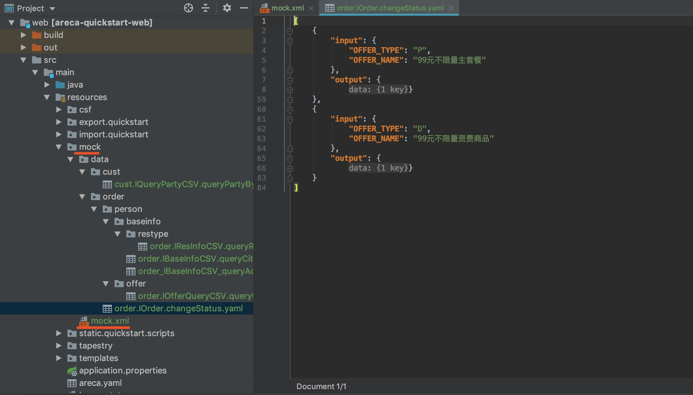

# bits 快速入门工程
针对集中化V0版本、CMPAK V0版本，基于AIF平台，结合CSF服务开发框架、AiCache缓存框架、AppFrame业务开发框架、TouchUI2.0界面开发框架，为CRM系统深度定制的开发框架，本文档包括工程搭建、开发示例、开发规范三块内容，着手开发前请具备对AIF平台以及这些开发子框架的理解。

- AIF平台，请参考 http://aif.asiainfo.com/
- AppFrame开发说明文档，请阅读工程目录/document/aif下的相关文档
- TouchUI 2.0开发文档，请参看 http://touchui.wadecn.com

## 一、环境准备

### 必备软件

- Java 1.8.0_201
- IDEA or Eclipse，本文档采用IDEA 201803版本
- Git 2.20.1
- Gradle 4.10.3 下载地址：https://gradle.org/next-steps/?version=4.10.3&format=bin IDEA的gradle的 Offline work 不要勾选，会导致不从Maven库同步框架包，配置如下图：


注意：

​	导入工程时，Gradle的Group modules选项通常要选 "using explicit module groups"


## 二、Quickstart 工程搭建

### Git 示例工程

IDEA -> File -> New -> Project from Version Control -> Git

git地址：http://git.wadecn.com:18082/bits/bits-quickstart.git


### 工程目录说明

示例工程目录如下图：

```
bits\bits-quickstart:

├─document      文档目录
├─exeprocess    后台进程模块目录
│  │-build.gradle      后台进程模块gralde构建脚本
│  └─src			   后台进程模块源码目录
│      ├─main		   后台进程模块功能源码目录
│         └─java	   后台进程模块功能Java源码目录
|            └─com.asiainfo.quickstart.exeprocess 后台进程模块功能JAVA源码包路径
├─pub    公共模块目录
│  │-build.gradle      公共模块gradle构建脚本
│  └─src			   公共模块源码目录
│      ├─main		   公共模块功能源码目录
│         └─java	   公共模块功能Java源码目录
├─soa	  SOA服务模块目录
│  │-build.gradle      SOA服务模块gradle构建脚本
│  └─src			   SOA服务模块源码目录
│      ├─main		   SOA服务模块功能源码目录
│         ├─java	   SOA服务模块功能Java源码目录
|         |  ├─com.asiainfo.quickstart.app SOA服务模块功能JAVA源码包路径
│         └─resources  SOA服务模块资源目录，用于放置后台服务(CSF)所需的配置文件
├─web    前台WEB模块目录
│  │-build.gradle      前台WEB模块gradle构建脚本
│  └─src			   前台WEB模块源码目录
│      ├─main		   前台WEB模块功能源码目录
│         ├─java	   前台WEB模块功能Java源码目录
|            └─com.asiainfo.quickstart.web 前台WEB模块功能JAVA源码包路径
│                ├─component     业务模块Tapestry组件目录
│                ├─config        业务模块配置类目录
│                ├─controller    业务模块Spring控制类目录
│                ├─handler       业务模块HttpHandler类目录
│                ├─page          业务模块Tapestry页面类目录
│         └─resources  前台WEB模块资源目录，用于放置前台WEB所需的配置文件
│             ├─export.quickstart  导出配置文件目录
│             ├─import.quickstart  导入配置文件目录
│             ├─static.quickstart  静态资源文件目录
│             ├─tapestry           Tapestry配置和模板文件目录
│             │    ├─quickstart                  业务模块WEB前台Tapestry页面模板目录
│             │    ├─quickstart.application      业务模块WEB前台Tapestry应用入口配置
│             │    └─quickstart-page.application 业务模块WEB前台Tapestry页面扩展配置
│             ├─templates          Thymeleaf模板目錄文件目录
│             ├─application.properties    应用配置文件
│             ├─bits.yaml                bits框架配置文件
│             ├─wade-springboot.yaml      wade框架配置文件
|- build.gradle     工程全局gradle构建脚本，用于设置工程group,version和其它公共配置、属性
|- settings.gradle  工程全局gradle设置脚本，用于设置工程名和模块名、模块路径
└─ README.md    工程说明README文档

```

##### 目录结构说明

- document，文档目录，非开发必须；
- exeprocess，后台进程Module，采用E.T的开发规范；
- pub，前后台公共的Module，常用的工具类，但不能调服务，不能访问数据库；
- soa，后台服务Module，包括服务层的代码和SQL；
- web，前台Module，包括界面（*.html, *.page, *.application）、脚本资源以及、页面的Java类；
- build.gradle，编译打包脚本，一般不需要修改，会自动按Module打包；

#### 注意：

- 模块下的JAVA源码包路径格式统一规范为“com.公司名.工程名.模块类型”，例如：com.asiainfo.order.soa、com.asiainfo.order.web。

- 以前配置在web.xml里的WADE框架相关Servlet和Filter现在同一在wade-springboot.yaml中配置，分为d定的几种类型，按需配置，不需要使用的设置enabled=false

- SOA模块的配置文件放置在SOA模块的 src/main/resources下，WEB模块的配置文件放置在WEB模块的src/main/resources下，本机开发环境下，在WEB模块的gradle构建脚本的sourceSet里需要添加了对SOA模块resources的引用（示例工程已经添加）。

#### 构建新工程：

根据bits-quickstart示例工搭建其它工程时，主要需要涉及调整的目录结构和配置文件包括但不限于：
- 在工程的全局gradle构建脚本build.gradle中修改工程的group名和version版本号
- 在工程的全局gradle设置脚本settings.gralde中修改工程名和模块名及路径（如果需要）
- 修改各模块JAVA源码的包路径，将包路径中的工程名修改为对应的工程名
- 修改WEB模块资源路径resources下的导入导出，静态资源目录下的工程子目录名 
- 修改WEB模块资源路径resources下tapestry目录下的appication配置文件和工程子目录名，修改Tapestry入口application配置文件中的应用配置
- 修改wade-springboot.yaml中的Servlet和Filter配置
- 修改bits.yaml中的会话校验过滤器配置
- 修改CSF框架的相关数据源和缓存配置（如有必要）


#### 基于JRebel热部署

基于JRebel实现前后台代码热部署，已验证修改html，js，java都没有问题，配置文件目前还不支持，如*.yaml, *.application等；

- 安装JRebel插件并注册，破解方法 https://blog.csdn.net/cutelittlebo/article/details/77523368
- 基于JRebel运行web下的Application；
- 当代码修改时需要执行gradle的build，以生成新的out文件；
- html，js，css文件热部署需要添加JVM启动参数 -Dorg.apache.tapestry.disable-caching=true，可参看web下的Application.java

若JRebel启动报错，需要更新library 和 csf.factories 文件，文件主要添加如下内容
```text
#csf默认服务发现模块，优先级=0
com.ai.aif.csf.module.discover.CsfInvokerDiscover=3
```

#### 版本提交和同步

采用Git的版本管理，需要熟悉Git，并和SVN常用命令区分开

Git的操作命令如下：
- 添加到版本库 add
- 提交到版本库 commit
- 合并到远程版本库 push
- 从远程同步到本地库 pull

注：push时会提示有冲突


### 开发规范

#### 代码约束说明

该规约束说明对V0项目有效，适应V0内所有项目工程

1. html文件，不允许引入非框架的css，不允许编写自定义的css片段；
2. html文件，不允许引入非框架的JavaScript；
3. html文件，
4. javascript文件，提交到服务器的代码不能有console相关的代码；


#### Java代码规范

调试日志代码规范
```java
// 一律使用slf4j，切记不要用log4j
import org.slf4j.Logger;
import org.slf4j.LoggerFactory;

/**
 * 创建sl4j的Logger对象
 * 1. 修饰符  private static final transient；
 * 2. 不要通过继承的方式使用Logger对象；
 */
private static final transient Logger log = LoggerFactory.getLogger(SimpleQueryCSVImpl.class);

/**
* 输出调试日志，采用DEBUG级别
* 1. 必须添加isDebugEnabled判断；
* 2. 采用{}做为变量占位符；
*/
if (log.isDebugEnabled()) {
    log.debug("userinfo: {}={}", "operId", operId);
    log.debug("userinfo: {}={}", "channlId", channlId);
    log.debug("userinfo: {}={}", "sessionID", sessionID);
    log.debug("userinfo: {}={}", "orgId", orgId);
    log.debug("userinfo: {}={}", "orgName", orgName);
}


/**
* 输出业务核心日志，采用INFO级别，这类日志是需要后台用作分析时使用，一般业务日志请使用DEBUG级别
* 1. 必须添加isInfoEnabled判断；
* 2. 采用{}做为变量占位符；
*/
if (log.isInfoEnabled()) {
    StringJoiner joiner = new StringJoiner(",");
    joiner.add(serviceUUID).add(serviceCode).add(accessTime);
    log.info("服务接入日志:{}", joiner.toString());
}

/**
* 输出异常堆栈，采用ERROR级别
*/
log.error("error message", exception);

```


### 前台界面开发（WEB）

前台开发采用SpringBoot方式启动，不需要配置web.xml，原配置内容迁移到wade-springboot.yaml，前台调用服务采用CSF的客户端，支持开发时前后台在同一个工程。

#### 启动进程
com.asiainfo.quickstart.web.Application 右键执行即可启动，监听地址配置在application.properties里。

开发模式代码自动更新，添加JVM参数配置说明如下：

- 增加JVM参数 -Dorg.apache.tapestry.disable-caching=true 禁用tapestry缓存；
- 增加JVM参数 -javaagent:library/spring/springloaded-1.2.8.RELEASE.jar -noverify 启用springloaded-热加载；
- 也可以使用Idea的JRebel插件来做热加载，效果更好；

#### 开发说明

示例自带了查询和受理的两套简单模板，SimpleAccept、SimpleQuery。

- 组件开发参看 com.asiainfo.quickstart.web.component；
- 页面类开发参看 com.asiainfo.quickstart.web.page；
- html&page开发参看 resources/tapestry/quickstart/page；
- js开发参看 resources/static/quickstart/scripts；
- 开发菜单配置参看 bits.yaml 里 touchframe.menu 项；


##### 菜单配置（开发模式）

针对开发模式实现文本型的菜单配置功能，配置文件在bits.yaml，暂不支持定制接口

```json
touchframe.menu:
  groups: [
    {
      name: "开发样例",
      subgroups: [
        {
          name: "业务样例",
          items: [
            {name: "基本查询", url: "?service=page/quickstart.page.demo.business.query.SimpleQuery"},
            {name: "基本受理", url: "?service=page/quickstart.page.demo.business.accept.SimpleAccept"}
           ]
        },
        {
          name: "其它模块",
          items: [
            {name: "订单中心", url: "order/order?service=page/order.page.business.OrderDemo"},
            {name: "客户中心", url: "cust/cust?service=page/cust.page.business.CustDemo"}
           ]
        }
      ]
    }
  ]

```


##### 统一认证 && 单点登录（同域）

为解决多模块的页面集成，内置了基于Redis实现的统一认证功能，通过添加配置即可实现同域的多页面集成

前置说明：
- 所有模块在同一个域下，即应用访问的IP和端口相同，一般通过反向代理haproxy实现
- 所有模块基于TouchUI的开发规范，可避免兼容性问题；
- 跨域跨框架的场景不在此例；

配置说明如下：
- 启动sso,sna的过滤器

```json
//wade-springboot.yaml添加过滤器，并设置enabled 为 true

filter:
  sso:
    name: sso
    servletNames: quickstart
    #urlPatterns: /examples/*,/data/*,/quickstart,/handler,/attach,/impexp
    order: 2
    enabled: true
  sna:
    name: sna
    servletNames: handler,attach,impexp,quickstart
    #urlPatterns: /examples/*,/data/*,/quickstart,/handler,/attach,/impexp
    order: 3
    enabled: true

```

- 添加redis的sna集群

```xml
# redis.xml里添加sna
<cluster name="sna" desc="会话缓存">
    <heartbeat-second>5</heartbeat-second>
    <pool-size>2</pool-size>
    
    <address master="127.0.0.1:13001" />
</cluster>

```

##### 前台服务调用

后台服务化后，前台就只能通过服务来调用后台业务逻辑，如下是一个分页查询的示例，示例代码在com.asiainfo.quickstart.web.page.demo.business.query.SimpleQuery.java里

关键代码段如下：

```java
//模拟服务调用
IData response = CenterClient4Web.call("Demo.SimpleQuery", getData(), getPagination());

// 设置表格数据，自动转换成IDataset
setInfos(response.getDataset("subscribers"));

// 设置分页Count数据
setInfoCount(response.getLong("count"));
```

##### 服务Mock

支持服务Mock模式，需要Mock的服务配置在mock.xml里，且需要`开启Mock`

- 开启Mock，在mock.xml里添加`<mockMode value="true"/>`
- 添加Mock的服务，在mock.xml里添service, serviceGroup的值对应mock/data/下的子目录

mock.xml配置示例如下：
```xml
<?xml version="1.0" encoding="UTF-8"?>
<mockCfg>
    <!-- mock模式是否开启，true是 flase 否-->
    <mockMode value="true"/>

    <!--需要mock的服务分组-->
    <serviceGroup value="order">
		<service value="order.IOrder.changeStatus"/>
		<service value="order.IOfferQueryCSV.queryUmOfferBySubIdAndOfferType"/>
    </serviceGroup>

    <serviceGroup value="cust">
        <service value="cust.IQueryPartyCSV.queryPartyByPartyId"/>
    </serviceGroup>
    

</mockCfg>
```

mock的配置数据内容为yaml格式，内容如下图：




##### 按中心远程调用

针对远程联调模式，支持按服务中心走远程调用模式，该模式下本地事务和远程事务不一致。

修改csf/csf.develop.xml文件，按如下示例添加配置

```xml
	<Category name="centercode.direct" description="中心级别直连方式">
		<Item name="BS">
			<value>socket://10.13.3.19:10003?protocol=socket</value>
		</Item>
	</Category>
```

#### 常用API

##### 静态参数API

1、com.asiainfo.bits.staticparam.StaticUtil 提供对 BS_STATIC_DATA 和 BS_PARA_DETAIL 两个表的数据读取API，并能直接在前台界面上显示成下拉组件的数据
2、针对bs_static_data表，添加EN_US_NAME字段，API支持自动根据多语言参数转换翻译内容；

后台soa层的defaults.xml里需要添加如下内容：
```xml
<!-- 静态参数 -->
<property name="com.asiainfo.bits.soa.bsparam" value="BASE" />
```

HTML 下拉示例代码如下：
```html
<span jwcid="@Select"
      name="COND_NAME"
      source="ognl:@com.asiainfo.bits.staticparam.StaticUtil@getStaticList('DEMO_QUERY_SELECT')"
      addDefault="true"
      onchange="alert('change action:' + this.value + '|' + this.selectedText)"
      defaultText="查询条件"
      nullable="no"
      desc="查询条件"
      class="e_select e_select-r"
></span>
```

2、com.asiainfo.bits.staticparam.StaticUtil 提供对 指定的表查询，表名必须要是能缓存的参数类型，且定义在CFG_CACHE_TABLE表里

API 支持读取多条 getList, 单条 getMap，单个字段值 getValue，支持对应默认的简化API，完整示例如下：

```java
/**
 * 查询参数表多行数据，查询没有数据返回空的ArrayList对象
 * @param tableId   定义在CFG_CACHE_TABLE
 * @param cols  需要查询的字段集
 * @param keys  条件字段集
 * @param values    条件字段值的集合
 * @param orders    排序字段集
 * @param ascent    升序或降序
 * @return
 * @throws Exception
 */
public static List<Map<String, Object>> getList(String tableId, String[] cols, String[] keys, String[] values, String[] orders, boolean ascent) throws  Exception


/**
 * 返回getList的第一条数据，若getList返回空或无数据，则返回空的HashMap
 * @param tableId   定义在CFG_CACHE_TABLE
 * @param cols  需要查询的字段集
 * @param keys  条件字段集
 * @param values    条件字段值的集合
 * @param orders    排序字段集
 * @param ascent    升序或降序
 * @return
 * @throws Exception
 */
public static Map<String, Object> getMap(String tableId, String[] cols, String[] keys, String[] values, String[] orders, boolean ascent) throws  Exception 


/**
 * 从getMap里返回指定Col的值，若为NULL则返回def默认值
 * @param tableId   定义在CFG_CACHE_TABLE
 * @param col  需要查询的字段集
 * @param keys  条件字段集
 * @param values    条件字段值的集合
 * @param def   默认值，若不传则默认为""
 * @return
 * @throws Exception
 */
public static String getValue(String tableId, String col, String[] keys, String[] values, String def) throws  Exception 

```


### 后台服务开发（SOA）

后台服务以csf和appframe的开发规范为主，添加了服务注解、服务Mock、异常编码、SQL结果集缓存、配置读取等功能。

#### 开发说明

示例自带了查询和受理的两个服务的简单实现。

- csf服务开发，参看ISimpleQueryCSV.java，添加服务注解以及服务实现SimpleQueryCSVImpl.java；
- appframe服务开发，参看ISimpleQuerySV.java，完全按AppFrame规范开发，请参看开发文档获取更详细帮助；
- 异常开发，参看QueryError.java，支持多语言自动识别；
- 配置读取，参看SimpleQueryConfig.java，主要是解决读取配置时强制转换的逻辑；

```java

/**
 * 示例：
 * 1、获取请求报文里的数据；
 * 2、获取分页数据；
 * 3、获取会话数据，并采用Logger Debug 输出调试日志；
 * 4、获取当前服务名，并采用Logger Info 输出业务核心日志；
 * 5、抛出异常，当request的NAME字段值=ERROR时触发；
 * 6、读取配置数据；
 * 7、调用IxxSV的服务；
 * 8、数据返回
 *
 * @param request   请求报文内容，包括业务数据，不包括会话信息
 * @return
 * @throws Exception
 */
@Override
public Map<String, Object> simpleQuery(Map<String, Object> request) throws Exception {
    // 获取请求报文内容
    String condName = CSFDatas.getAsString(request, "COND_NAME");

    // 获取分页信息
    int pageCurrent = CSFDatas.getPageCurrent(request);
    int pageSize = CSFDatas.getPaginSize(request);
    int pageStart = CSFDatas.getPaginStart(request);
    int pageEnd = CSFDatas.getPaginEnd(request);
    boolean isNeedCount = CSFDatas.isPaginNeedCount(request);
    boolean isOnlyCount = CSFDatas.isPaginOnlyCount(request);


    //  获取会话信息
    BusinessUserInfo userInfo = (BusinessUserInfo) SessionManager.getUser();
    String operId = userInfo.getOpId(); // 操作员标识
    String channlId = userInfo.getChannlId();   // 接入渠道标识
    String sessionID = userInfo.getSessionID(); // 会话标识
    long orgId = userInfo.getOrgId();   // 组织标识
    String orgName = userInfo.getOrgName(); //组织名称
    String mgmtDistrict = userInfo.getMgmtDistrict();//管理地区
    String mgmtCounty = userInfo.getMgmtCounty();//管理县市

    // 输出调试日志，采用DEBUG级别
    if (log.isDebugEnabled()) {
        log.debug("userinfo: {}={}", "operId", operId);
        log.debug("userinfo: {}={}", "channlId", channlId);
        log.debug("userinfo: {}={}", "sessionID", sessionID);
        log.debug("userinfo: {}={}", "orgId", orgId);
        log.debug("userinfo: {}={}", "orgName", orgName);
        log.debug("userinfo: {}={}", "mgmtDistrict", mgmtDistrict);
        log.debug("userinfo: {}={}", "mgmtCounty", mgmtCounty);
    }

    // 获取当前服务名、接入时间、服务请求标识
    String serviceCode = ServiceContext.getInstance().getServiceCode();
    String accessTime = ServiceContext.getInstance().getAccessTime("yyyy-MM-dd");
    String serviceUUID = ServiceContext.getInstance().getUUID();

    // 输出业务核心日志，采用INFO级别
    if (log.isInfoEnabled()) {
        StringJoiner joiner = new StringJoiner(",");
        joiner.add(serviceUUID).add(serviceCode).add(accessTime);
        log.info("服务接入日志:{}", joiner.toString());
    }


    // 模拟抛出异常
    if ("ERROR".equals(condName)) {
        Throws.error(QueryError.QUERY_ERROR, condName);
    }


    // 模拟读取yaml配置
    SimpleQueryConfig sqc = bitsConfigure.getInstance().getConfig(SimpleQueryConfig.class);
    sqc.getAge();


    // 调用IxxSV的服务，在CSV里，每执行一次sv的方法都将开启一个独立的事务，切记！！！
    ISimpleQuerySV sv = (ISimpleQuerySV) ServiceFactory.getService(ISimpleQuerySV.class);

    // 创建模拟的DataContainer[]型数据并存放在返回对象的result里
    DataContainer[] subscribers = sv.query(condName);

    // 创建模拟的List型数据并存放在返回对象的result1里
    List<Map<String, String>> result1 = new ArrayList<>(10);
    for (int i = 0; i < 10; i++) {
        Map<String, String> info = new HashMap<>(10);
        info.put("TEXT", condName);
        info.put("SPEC", "规格" + i);
        info.put("NUM", String.valueOf(i));
        result1.add(info);
    }

    // 创建模拟的Map型数据并存放在返回对象的result2里，也可以直接返回
    Map<String, Object> result2 = new HashMap<>();
    result2.put("key1", "value1");
    result2.put("key2", "value2");
    result2.put("key3", "value3");

    // return result2;

    return CSFDatas.create()
            .put("result", subscribers)     // 返回DataContainer[]
            .putSingleList("result1", result1)  // 返回List
            .putSingleMap("result2", result2)   // 返回List
            .getData();
}
```


#### 后台获取会话信息（BusinessUserInfo）

从线程上下文获取定制的会话信息，其内容定义在每个服务的公共参数里

```java
//  获取会话信息
BusinessUserInfo userInfo = (BusinessUserInfo) SessionManager.getUser();
String operId = userInfo.getOpId(); // 操作员标识
String channlId = userInfo.getChannlId();   // 接入渠道标识
String sessionID = userInfo.getSessionID(); // 会话标识
long orgId = userInfo.getOrgId();   // 组织标识
String orgName = userInfo.getOrgName(); //组织名称
String mgmtDistrict = userInfo.getMgmtDistrict();//管理地区
String mgmtCounty = userInfo.getMgmtCounty();//管理县市

// 输出调试日志，采用DEBUG级别
if (log.isDebugEnabled()) {
    log.debug("userinfo: {}={}", "operId", operId);
    log.debug("userinfo: {}={}", "channlId", channlId);
    log.debug("userinfo: {}={}", "sessionID", sessionID);
    log.debug("userinfo: {}={}", "orgId", orgId);
    log.debug("userinfo: {}={}", "orgName", orgName);
    log.debug("userinfo: {}={}", "mgmtDistrict", mgmtDistrict);
    log.debug("userinfo: {}={}", "mgmtCounty", mgmtCounty);
}
```

#### 后台分页控制

当前台发起分页请求时，后台通过CSFDatas.getPaginXXX可以获取分页的请求数据，为避免每次查询都需要执行Count，尤其是Count非常消耗性能时，可通过isNeedCount & isOnlyCount来控制

示例代码在com.asiainfo.quickstart.soa.demo.business.service.impl.SimpleQueryCSVImpl里，关键代码段如下：
```java
// 获取分页信息
int pageCurrent = CSFDatas.getPaginCurrent(request);
int pageSize = CSFDatas.getPaginSize(request);
int pageStart = CSFDatas.getPaginStart(request);
int pageEnd = CSFDatas.getPaginEnd(request);
boolean isNeedCount = CSFDatas.isPaginNeedCount(request);
boolean isOnlyCount = CSFDatas.isPaginOnlyCount(request);
int count = CSFDatas.getPaginCount(request);

// 判断是否需要执行 Count 的sql
if (isNeedCount || isOnlyCount) {
    count = sv.countSubscribers("921", condName);
}

// 将 count 数据返回
return CSFDatas.create().putAsString("count", count).getData();
```

#### 服务模糊化

配置说明请阅读 document/aif/cmpak/模糊化配置流程.docx

### DAO开发

#### 将*.sql编译到classes目录

- 在soa的module下找到build.gradle文件，添加如下内容：

```text
classes {
    dependsOn 'copySql'
}

task copySql(type:Copy) {
    from 'src/main/java'
    into 'out/production/classes'
    include '**/*.sql'
}
```

- 在Gradle面板->soa->Tasks->build->build，双击执行即可


#### 开发说明

- 对表增删改的操作，使用appframe提供的bo；
- 对表的查询操作，使用bits-express提供的api（类似于原来的CODE_CODE）；
- DAO文件的命名规范是IXX表名DAO和XX表名DAOImpl，其中IXXDAO是接口类，XXDAOImpl是对应的实现类；例如对于UM_BUNDLE_OFFER_REL表查询的DAO，则文件名为`IUmBundleOfferRel`和`UmBundleOfferRelImpl`；
- DAO对应的.sql文件和DAOImpl放到同一级目录下；
- DAO文件的包路径一般情况是com.asiainfo.XXModule.soa.repository.XX数据库用户名.XX表名；例如订单中心涉及的crm用户下的表UM_BUNDLE_OFFER_REL表，则其DAO文件对应的包路径则为：`com.asiainfo.order.soa.repository.crm.umbundleofferrel`
- 数据路由，数据路由的配置全部配在DAO层的包路径上，在DAO层做数据路由控制，示例参看defaults.xml文件。

```xml
<mapping>
	<property name="com.asiainfo.quickstart.app.repository.dao.base" value="base" />
	<property name="com.asiainfo.quickstart.app.repository.dao.crm" value="CRM{CENTER}" />
</mapping>
```

对于分库的表，即数据路由配置的是类似于`CRM{CENTER}`这种的，不再通过在代码里设置中心的方式来控制访问的数据库，而是通过定义在DAO实现类方法上的注解`@DBRoute`来控制。

`切记@DBRoute不能定义在重复的方法名上`


```java
@DBRoute(routeType = RouteTypeEnum.UserId, parameterIndex = 0)
public DataContainer[] querySubscriberByAnTag(String accessNum, String subscriberStatus) throws Exception {
    Map<String, String> param = new HashMap<>();
    param.put("ACCESS_NUM", accessNum);
    param.put("SUBSCRIBER_STATUS", subscriberStatus);
    return this.executeQuery("SEL_UM_SUBSCRIBER_BY_SN_TAG", param);
}
```

DBRoute注解有2个属性：
- routeType属性指定路由类型，可查看类`RouteTypeEnum`；
- parameterIndex属性表示指定路由值是从第几个参数里取值，从0算起。

#### 示例代码

- 参看com.asiainfo.quickstart.soa.repository.dao.crm.umsubscriber.impl.UmSubscriberDAOImpl